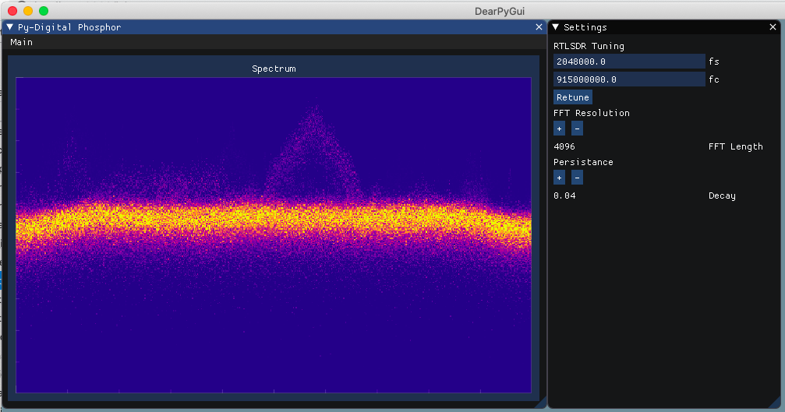

# Python-Digital-Phosphor-Display
Real-time GUI display for the intensity graded FFT function using RTLSDR as an input device



## Run Instructions

Install the following libraries with pip
```
pip install numpy
pip install dearpygui
pip install pyrtlsdr
``` 
Run the GUI with python

```
python py_digital_phosphor.py
```

Make sure to have the RTLSDR connected via USB when running.

## Features

I created a short video that shows all the current features of the GUI interface and how they relate the spectrum display.

[YouTube: Python Digital Phosphor Display](https://youtu.be/GPoQYTfQMxw)


## Blog Post

If you want to learn more about how I created the GUI with DearPyGui check out my blog post below.

[Tea and Tech Time: Python Digital Phosphor Display with DearPyGui](https://teaandtechtime.com/python-digital-phosphor-display-with-dearpygui/)

## Notes
This GUI is based on my previous work creating intensity graded FFTs with Matplotlib

[Python Intensity Graded FFT Plots](https://github.com/Tschucker/Python-Intensity-Graded-FFT)
